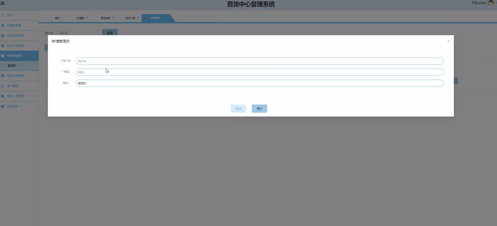
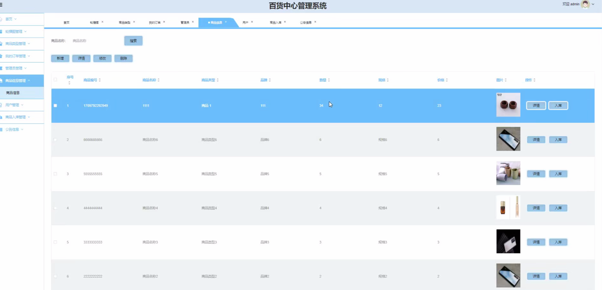
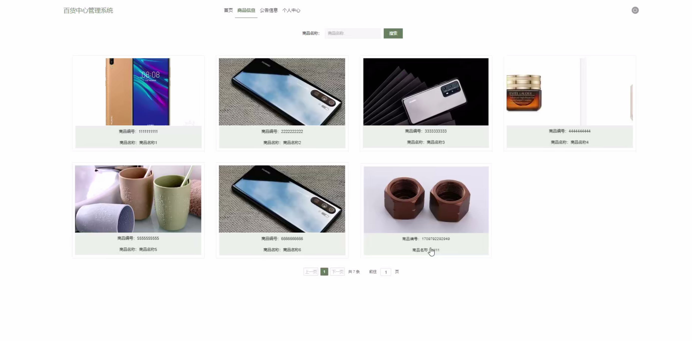
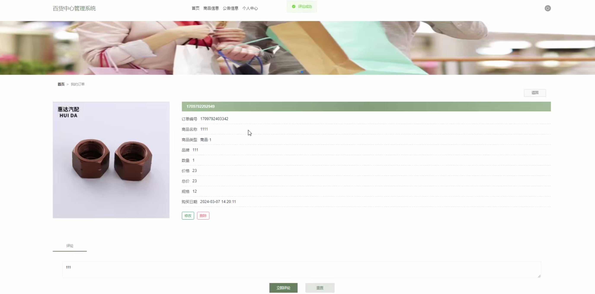

# 基于Java的百货中心管理系统的设计与实现

#### 介绍
基于Java的百货中心管理系统的设计与实现；附有完整源码➕数据库➕文档等。
本项目可以用于毕业设计，白嫖勿扰！
全网毕业设计项目这里都有

#### 课题背景
随着零售行业的快速发展和消费者需求的不断变化，百货中心作为城市商业的重要组成部分，面临着日益复杂的运营和管理需求。传统的管理方式往往依赖于人工记录和分散的管理工具，难以满足现代化运营的效率和精准性要求。尤其是在商品管理、库存调配、销售分析和客户服务等环节，传统方式的低效与不灵活显得尤为突出。

为解决这些问题，信息化技术的应用成为百货中心管理的必然趋势。基于Java开发的百货中心管理系统，能够通过模块化设计和数据集成，覆盖商品管理、销售管理、库存管理和客户关系管理等核心功能，帮助百货中心实现业务流程的数字化和规范化。Java语言的跨平台特性和高性能特点，使得系统具有良好的稳定性、扩展性和安全性，能够满足不同规模百货中心的个性化需求。

通过设计和实现该系统，可以优化百货中心的日常运营流程，提升资源利用效率，降低运营成本，同时为管理者提供实时的数据支持和决策依据，助力百货中心在竞争激烈的市场环境中实现可持续发展。
#### 获取源码
V：13283346760

Q：985089028

注意：添加时备注项目名称

#### 软件架构
开发环境：JDK8、SpringBoot、Maven、MySQL、Vue

#### 安装教程

1.  下载IDEA集成开发工具
2.  配置Maven环境
3.  启动项目

#### 项目运行截图

